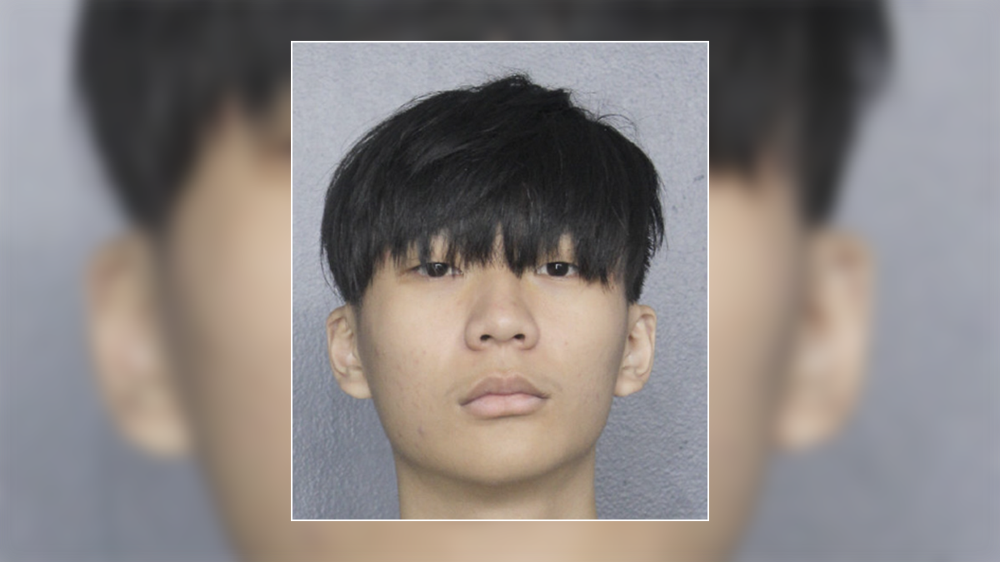

# Malone, accusé d’avoir volé et blanchi 230 millions de dollars de crypto-monnaie s’était fait passer pour un employé de Google pour tromper sa victime. 

Malone Lam, 20 ans, a été inculpé aux États-Unis de complot en vue de commettre une fraude électronique et de blanchiment d’argent.
Avec son co-conspirateur, Jeandiel Serrano, ils auraient volé plus de 4 100 bitcoins – d’une valeur d’environ 230 millions de dollars américains à l’époque – à une victime à Washington.

L’escroquerie a été décrite comme **"l’un des plus grands vols de crypto-monnaie d’un particulier ... dans l’histoire des États-Unis"**, ont déclaré les procureurs.

Mercredi 23 octobre au matin, heure de Singapour, Serrano a comparu devant le tribunal pour une audience sur l’état de l’instance.
Le tribunal a appris que l’accusation et la défense « cherchaient une résolution de cette affaire sans qu’un procès ne soit tenu », selon les dossiers judiciaires.
Ils ont demandé environ 60 jours pour poursuivre les négociations de plaidoyer et informeront le tribunal si un accord est conclu avant la date limite.

Des documents judiciaires rendus publics plus tôt ce mois-ci détaillent comment Lam et Serrano auraient mené l’escroquerie et comment ils ont dépensé l’argent.

# Partie 1 : Le vol 
Lam et son co-conspirateur Serrano, 21 ans, de Los Angeles, ont ciblé la victime parce qu’ils l’ont identifié comme un « investisseur fortuné » dès les premiers jours de la crypto-monnaie.
Selon les documents judiciaires, une planification substantielle a été mise en œuvre dans l’escroquerie, un co-conspirateur ayant provoqué l’envoi de notifications d'"accès non autorisé au compte Google » à la victime dans la semaine précédant le vol.
Cette personne a également utilisé des services proxy et de réseau privé virtuel (VPN) pour faire croire que les tentatives d’accès provenaient de l’étranger – ce qui a jeté les bases du vol grâce à une « ingénierie sociale sophistiquée ».
Le tribunal a appris que le 18 août, Lam et son complice ont appelé la victime, prétendant être des membres de l’équipe d’assistance de Google. Ils ont dit qu’il y avait eu une tentative de piratage sur son compte et qu’ils devaient le fermer.
Les deux hommes ont finalement convaincu la victime de fournir les codes de sécurité à son compte, avant que Lam n’accède aux comptes OneDrive et Gmail de la victime pour localiser les actifs en crypto-monnaie.
Il a également « fouillé » les comptes privés de la victime à la recherche d’informations supplémentaires, selon des documents judiciaires.

Les conspirateurs ont convenu que l’un d’entre eux devrait rappeler la victime et se faire passer pour un membre de l’équipe de sécurité de Gemini pour convaincre la victime que ses comptes de crypto-monnaie avaient également été compromis.

Initialement, ils auraient convaincu la victime de transférer environ 3 millions de dollars américains de crypto-monnaie vers un portefeuille de crypto-monnaie contrôlé par Lam.

Ils ont ensuite demandé à la victime de télécharger un programme de connexion à distance pour sa propre sécurité. Ce programme a donné à Lam et Serrano un accès en temps réel à l’ordinateur de la victime.

Serrano aurait continué à manipuler la victime pour qu’elle ouvre plusieurs fichiers, y compris ceux contenant des clés privées de plus de 4 100 bitcoins.

Alors que Serrano continuait à parler avec la victime, Lam a utilisé les clés d’accès pour voler le bitcoin.

Les procureurs ont déclaré qu’ils disposaient d’enregistrements d’écran montrant Lam en utilisant le pseudonyme Telegram « $$$ » et le nom d’affichage Discord « Anne Hathaway » pour discuter de stratégies visant à manipuler la victime.

Serrano a utilisé les surnoms en ligne « VersaceGod » et « @SkidStar ».

Les autorités ont déclaré qu’elles disposaient de nombreux documents et photos reliant le pseudo Telegram à Lam.

L’une des photos est celle de Lam avec une nouvelle voiture de sport blanche, avec son nom peint sur le côté. Il a envoyé cette photo à ses amis en utilisant le pseudo $$$ Telegram.

Lors d’un entretien avec la police, Lam a également admis avoir utilisé le pseudonyme Telegram $$$, avoir commis un vol de crypto-monnaie et divisé les fonds volés, ainsi que blanchir ces fonds par le biais d’échanges de crypto-monnaies.

Serrano aurait créé un compte sur TradeOgre, un bureau d’échange de devises numériques, et effectué un dépôt d’environ 29 millions de dollars américains en monnaie virtuelle.

Il n’a pas utilisé de VPN lorsqu’il a créé le compte, et les dossiers de TradeOgre ont montré que le compte a été créé à partir d’une adresse IP enregistrée au domicile de Serrano à Encino, en Californie, qui était loué à 47 500 $ US par mois.

La maison en Californie que Serrano louait à 47 500 dollars par mois.

# Partie 2 : Les dépenses qui ne passent pas inaperçu

Lam s’est lancé dans une frénésie de dépenses à la suite du vol, selon les documents judiciaires.

« La surveillance gouvernementale a filmé (Lam) dans les boîtes de nuit de Los Angeles dépensant des centaines de milliers de dollars par nuit et offrant des sacs à main d’une valeur de dizaines de milliers de dollars », a déclaré un agent des forces de l’ordre au tribunal, selon des documents judiciaires.

La direction des boîtes de nuit a déclaré que Lam avait essayé de payer en crypto-monnaie et dépensait environ **400 000 à 500 000 dollars par nuit.
**

L’accusation dispose également d’un reçu d’une boîte de nuit de Los Angeles où Lam a dépensé 569 528,39 $ US en une nuit.

Lam aurait également acheté une « collection de voitures de luxe », dont certaines ont coûté jusqu’à 3 millions de dollars. Il s’agissait notamment de Lamborghini, de Ferrari et de Porsche personnalisées.

Selon les documents judiciaires, Lam a admis avoir acheté 31 voitures de luxe, dont 22 n’avaient pas encore été retrouvées au 24 septembre. L’une de celles qui manquent encore est la voiture avec « Malone » peint sur le côté.

Le 10 septembre, Lam s’est envolé en jet privé de Los Angeles à Miami pour poursuivre sa frénésie de dépenses.

Il a loué plusieurs maisons à Miami, dont une sur l’île Hibiscus et deux autres maisons luxueuses près de l’eau. L’une de ces maisons avait un loyer mensuel de 68 000 $ US.

À Miami, Lam a continué à dépenser de l’argent dans les boîtes de nuit, ainsi que pour des bijoux et des voitures.

ARRESTATIONS

Serrano a été arrêté à l’aéroport international de Los Angeles le 18 septembre alors qu’il rentrait chez lui après des vacances aux Maldives avec sa petite amie.

Bien que le Federal Bureau of Investigation lui ait dit que « la seule façon d’aggraver la situation serait qu’elle appelle les associés de Serrano et les avertisse », la petite amie de Serrano a informé Lam de l’arrestation.

PUBLICITÉ

Le Singapourien a immédiatement supprimé son compte Telegram.

Lam a été arrêté le même jour à Miami.

Dans deux de ses maisons à Miami, les agents ont saisi neuf voitures et montres de luxe, dont l’une a coûté 1,8 million de dollars. Ils ont également trouvé des actes de vente pour certaines de ces voitures.

Lors d’un entretien avec la police, Lam a admis avoir effectué d’autres piratages et gagné des millions grâce à ces stratagèmes distincts de fraude aux cryptomonnaies.

RENVOYÉ

Lam n’a pas de statut légal aux États-Unis, a appris le tribunal.

Il est arrivé en octobre 2023 dans le cadre du programme américain d’exemption de visa, qui permet aux touristes de visiter le pays jusqu’à 90 jours sans visa.

Alors qu’il était aux États-Unis, Lam n’avait pas de résidence permanente, n’avait pas d’emploi et « payait son style de vie somptueux avec des fonds volés », a entendu le tribunal lors de la tentative du gouvernement de le maintenir en détention provisoire.

« De plus, (Lam) dispose d’actifs substantiels qui n’ont pas encore été localisés, ce qui lui donne les moyens financiers de fuir. »

Pour chaque chef d’accusation de complot en vue de commettre une fraude électronique et de blanchiment d’argent, il pourrait être emprisonné jusqu’à 20 ans et condamné à une amende pouvant aller jusqu’à 250 000 $ US, soit jusqu’à deux fois ses gains provenant de ces escroqueries.

